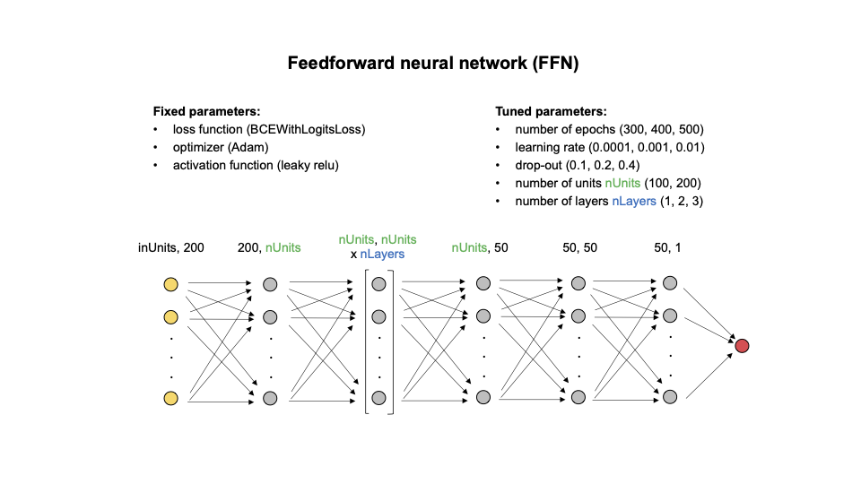

# Definition of Hyperparameters

Definition of the set of hyperparameters in the __*parameters.txt*__ file.

---

### Deep learning (DL) methods

The hyperparameters corresponding to the DL methods, CNN and FFN, are illustrated in the image below:

#### FFN and CNN

  * __numepv:__ Number of epochs in the model. An epoch is one complete cycle through the entire training dataset by the learning algorithm. Values are positive integers.
  * __learningratev:__ Learning rate corresponding to the parameter _'lr'_ in the [torch.optim.Adam](https://pytorch.org/docs/stable/generated/torch.optim.Adam.html) class.
  * __selfdrv:__ Probability of an element to be zeroed in dropout. This is controlled by the parameter _'p'_ in the [torch.nn.functional.dropout](https://pytorch.org/docs/stable/generated/torch.nn.functional.dropout.html) function.
  * __nunitsv:__ Number of units, depicted in green in the figure, which determine the width of the FFN. Values are positive integers.
  * __nlayersv:__ Number of layers, depicted in blue in the figure, which determine the depth of the FFN. Values are positive integers.
  * __balancev:__ Balancing of cases and controls is specified as the percentage of controls relative to the total number of cases and controls.(Ex. a value of 60 indicates that 60% of the samples are controls and 40% are cases). Values range from 0 to 100.
  * __samplingv:__ Sampling strategy. Can be defined with 4 different input strings:
    * _random:_ Random under-sampling implemented with the [imblearn.under_sampling.RandomUnderSampler](https://imbalanced-learn.org/stable/references/generated/imblearn.under_sampling.RandomUnderSampler.html) class.
    * _ENN:_ Edited Nearest Neighbors (ENN) method for under-sampling implemented with the [imblearn.under_sampling.EditedNearestNeighbours](https://imbalanced-learn.org/stable/references/generated/imblearn.under_sampling.EditedNearestNeighbours.html) class.
    * _SMOTE_random:_ Synthetic Minority Over-sampling Technique (SMOTE) method for over-sampling implemented with the [imblearn.over_sampling.SMOTE](https://imbalanced-learn.org/stable/references/generated/imblearn.over_sampling.SMOTE.html) class, and combined with the random under-sampling.
    * _SMOTE_ENN:_ SMOTE method for over-sampling combined with the ENN under-sampling.

--------------------------------------------------------
### Machine learning (ML) methods

#### LR
  * __solver:__ Algorithm to use in the optimization problem corresponding to the _'solver'_ parameter in the [sklearn.linear_model.LogisticRegression](https://scikit-learn.org/stable/modules/generated/sklearn.linear_model.LogisticRegression.html) class.
  * __creg:__ Inverse of regularization strength corresponding to the _'C'_ parameter in the [sklearn.linear_model.LogisticRegression](https://scikit-learn.org/stable/modules/generated/sklearn.linear_model.LogisticRegression.html) class.
  * __balance:__ Balancing of cases and controls is specified as the percentage of controls relative to the total number of cases and controls.(Ex. a value of 60 indicates that 60% of the samples are controls and 40% are cases). Values range from 0 to 100.
  * __sampl_strategy:__ Sampling strategy. Can be defined with 4 different input strings:
    * _random:_ Random under-sampling implemented with the [imblearn.under_sampling.RandomUnderSampler](https://imbalanced-learn.org/stable/references/generated/imblearn.under_sampling.RandomUnderSampler.html) class.
    * _ENN:_ Edited Nearest Neighbors (ENN) method for under-sampling implemented with the [imblearn.under_sampling.EditedNearestNeighbours](https://imbalanced-learn.org/stable/references/generated/imblearn.under_sampling.EditedNearestNeighbours.html) class.
    * _SMOTE_random:_ Synthetic Minority Over-sampling Technique (SMOTE) method for over-sampling implemented with the [imblearn.over_sampling.SMOTE](https://imbalanced-learn.org/stable/references/generated/imblearn.over_sampling.SMOTE.html) class, and combined with the random under-sampling.
    * _SMOTE_ENN:_ SMOTE method for over-sampling combined with the ENN under-sampling.

#### GB
  * __n_estimators:__ The number of boosting stages to perform corresponding to the _'n_estimators'_ parameter in the [sklearn.ensemble.GradientBoostingClassifier](https://scikit-learn.org/stable/modules/generated/sklearn.ensemble.GradientBoostingClassifier.html) class.
  * __learning_rate:__ Learning rate corresponding to the _'learning_rate'_ parameter in the [sklearn.ensemble.GradientBoostingClassifier](https://scikit-learn.org/stable/modules/generated/sklearn.ensemble.GradientBoostingClassifier.html) class.
  * __subsample:__ The fraction of samples to be used for fitting the individual base learners corresponding to the _'subsample'_ parameter in the [sklearn.ensemble.GradientBoostingClassifier](https://scikit-learn.org/stable/modules/generated/sklearn.ensemble.GradientBoostingClassifier.html) class.
  * __max_depth:__ Maximum depth of the individual regression estimators corresponding to the _'max_depth'_ parameter in the [sklearn.ensemble.GradientBoostingClassifier](https://scikit-learn.org/stable/modules/generated/sklearn.ensemble.GradientBoostingClassifier.html) class.
  * __loss:__ The loss function to be optimized corresponding to the _'loss'_ parameter in the [sklearn.ensemble.GradientBoostingClassifier](https://scikit-learn.org/stable/modules/generated/sklearn.ensemble.GradientBoostingClassifier.html) class.
  * __balance:__ Balancing of cases and controls is specified as the percentage of controls relative to the total number of cases and controls.(Ex. a value of 60 indicates that 60% of the samples are controls and 40% are cases). Values range from 0 to 100.
  * __sampl_strategy:__ Sampling strategy. Can be defined with 4 different input strings:
    * _random:_ Random under-sampling implemented with the [imblearn.under_sampling.RandomUnderSampler](https://imbalanced-learn.org/stable/references/generated/imblearn.under_sampling.RandomUnderSampler.html) class.
    * _ENN:_ Edited Nearest Neighbors (ENN) method for under-sampling implemented with the [imblearn.under_sampling.EditedNearestNeighbours](https://imbalanced-learn.org/stable/references/generated/imblearn.under_sampling.EditedNearestNeighbours.html) class.
    * _SMOTE_random:_ Synthetic Minority Over-sampling Technique (SMOTE) method for over-sampling implemented with the [imblearn.over_sampling.SMOTE](https://imbalanced-learn.org/stable/references/generated/imblearn.over_sampling.SMOTE.html) class, and combined with the random under-sampling.
    * _SMOTE_ENN:_ SMOTE method for over-sampling combined with the ENN under-sampling.

#### ET and RF
  * __n_estimators:__ The number of trees in the forest corresponding to the _'n_estimators'_ parameter in the [sklearn.ensemble.ExtraTreesClassifier](https://scikit-learn.org/stable/modules/generated/sklearn.ensemble.ExtraTreesClassifier.html) and [sklearn.ensemble.RandomForestClassifier](https://scikit-learn.org/stable/modules/generated/sklearn.ensemble.RandomForestClassifier.html) classes.
  * __min_samples_split:__ The minimum number of samples required to split an internal node corresponding to the _'min_samples_split'_ parameter in the [sklearn.ensemble.ExtraTreesClassifier](https://scikit-learn.org/stable/modules/generated/sklearn.ensemble.ExtraTreesClassifier.html) and [sklearn.ensemble.RandomForestClassifier](https://scikit-learn.org/stable/modules/generated/sklearn.ensemble.RandomForestClassifier.html) classes.
  * __min_samples_leaf:__ The minimum number of samples required to be at a leaf node corresponding to the _'min_samples_split'_ parameter in the [sklearn.ensemble.ExtraTreesClassifier](https://scikit-learn.org/stable/modules/generated/sklearn.ensemble.ExtraTreesClassifier.html) and [sklearn.ensemble.RandomForestClassifier](https://scikit-learn.org/stable/modules/generated/sklearn.ensemble.RandomForestClassifier.html) classes.
  * __max_depth:__ The maximum depth of the tree corresponding to the _'max_depth'_ parameter in the [sklearn.ensemble.ExtraTreesClassifier](https://scikit-learn.org/stable/modules/generated/sklearn.ensemble.ExtraTreesClassifier.html) and [sklearn.ensemble.RandomForestClassifier](https://scikit-learn.org/stable/modules/generated/sklearn.ensemble.RandomForestClassifier.html) classes.
  * __balance:__ Balancing of cases and controls is specified as the percentage of controls relative to the total number of cases and controls.(Ex. a value of 60 indicates that 60% of the samples are controls and 40% are cases). Values range from 0 to 100.
  * __sampl_strategy:__ Sampling strategy. Can be defined with 4 different input strings:
    * _random:_ Random under-sampling implemented with the [imblearn.under_sampling.RandomUnderSampler](https://imbalanced-learn.org/stable/references/generated/imblearn.under_sampling.RandomUnderSampler.html) class.
    * _ENN:_ Edited Nearest Neighbors (ENN) method for under-sampling implemented with the [imblearn.under_sampling.EditedNearestNeighbours](https://imbalanced-learn.org/stable/references/generated/imblearn.under_sampling.EditedNearestNeighbours.html) class.
    * _SMOTE_random:_ Synthetic Minority Over-sampling Technique (SMOTE) method for over-sampling implemented with the [imblearn.over_sampling.SMOTE](https://imbalanced-learn.org/stable/references/generated/imblearn.over_sampling.SMOTE.html) class, and combined with the random under-sampling.
    * _SMOTE_ENN:_ SMOTE method for over-sampling combined with the ENN under-sampling.

