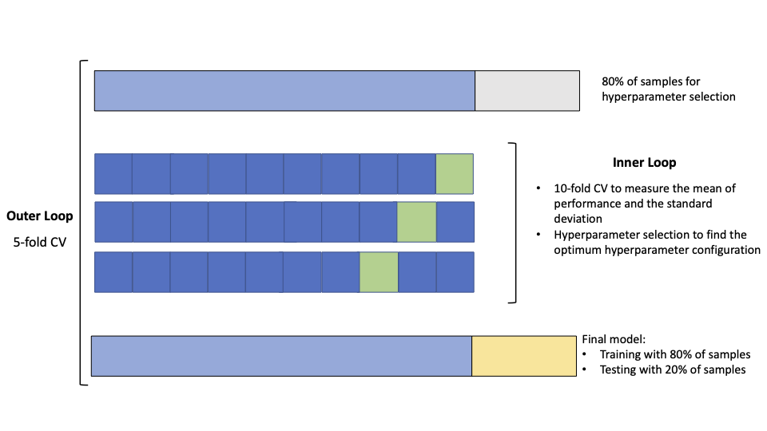

# Machine learning methods applied to classify complex diseases using genomic data

Python scripts for running the machine learning (ML) and deep learning (DL) models reported in the manuscript:
Magdalena Arnal Segura, 2024
https://doi.org/10.1101/2024.03.18.585541

This work is part of the PhD thesis titled [*"Machine Learning Methods Applied to Classify Complex Diseases Using Genomic Data"*](URL) defended by Magdalena Arnal Segura in March 2024 at Sapienza Università di Roma.

### Author/Support

https://github.com/machalen/ML_complex_diseases/issues </br>

### Directory Contents

  * __Hyperparameters:__ All parameters used in the hyperparameter selection process.
  * __Python_scripts:__ Python scripts divided in different subdirectories corresponding to the different ML and DL models.
  * __requirements.txt:__ Required packages for the installation.

### Running The Code

All the Python scripts are located in the 'Python_scripts' folder and are organized into subdirectories named according to the ML and DL methods used:

  * Logistic Regression (LR)
  * Gradient-Boosted Decision Trees (GB)
  * Random Forest (RF)
  * Extremely Randomized Trees (ET)
  * Feedforward neural network (FFN)
  * Convolutional neural networks (CNN)

The strategy employed is nested cross-validation (nested CV), which is an adaptation of the K-fold CV that consists in setting one outer loop and one inner loop of CV. In this approach, the CV in the inner loop is performed on the training set of the outer loop and is used to select the optimum hyperparameter configuration. This step is implemented in the scripts indexed with __*1_XX_With_nestedCV.py*__.

Conversely, the CV in the outer loop is used to train the final model with the selected hyperparameter configuration obtained from the inner loop, and to test the model with the remaining test set that has not been used for hyperparameter selection or training the model. This step is implemented in the scripts indexed with __*2_XX_FinalModel.py*__.

Iterating over different folds in the inner and outer loop allows for the use of different samples in training, validation, and testing in each iteration, optimizing the use of all the available samples. At the end, nested CV generate as many final models as number of folds in the outer loop.



#### Hyperparameter selection

The grid search approach is employed for hyperparameter selection, which involves defining a set of values for each hyperparameter and testing all possible combinations. The set of parameters are defined in the __*parameters.txt*__ file located in the directory __./Hyperparameters__. Hyperparameters are divided into subsections corresponding to each ML method. 

--------------------------------------------------------
#### Logistic Regression (LR)

```bash
# Get latest STAR source from releases
wget https://github.com/alexdobin/STAR/archive/2.7.11b.tar.gz
tar -xzf 2.7.11b.tar.gz
cd STAR-2.7.11b

# Alternatively, get STAR source using git
git clone https://github.com/alexdobin/STAR.git
```


### Limitations

This release was tested with the default parameters for human and mouse genomes.
Mammal genomes require at least 16GB of RAM, ideally 32GB.
Please contact the author for a list of recommended parameters for much larger or much smaller genomes.


